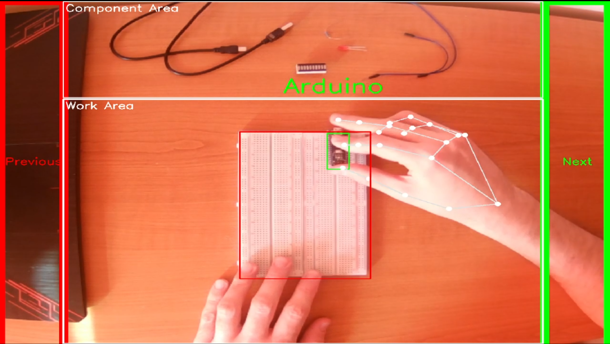
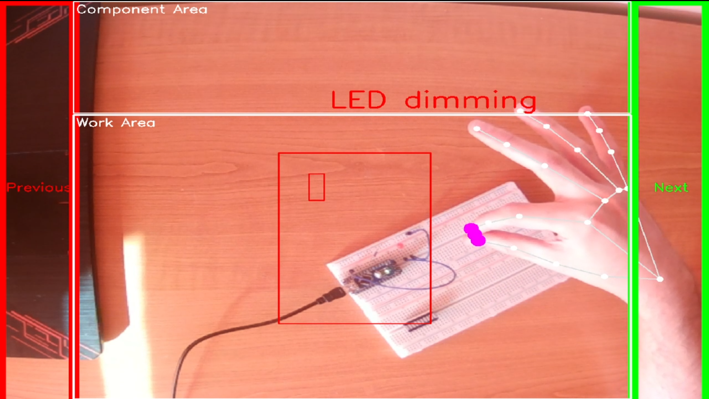
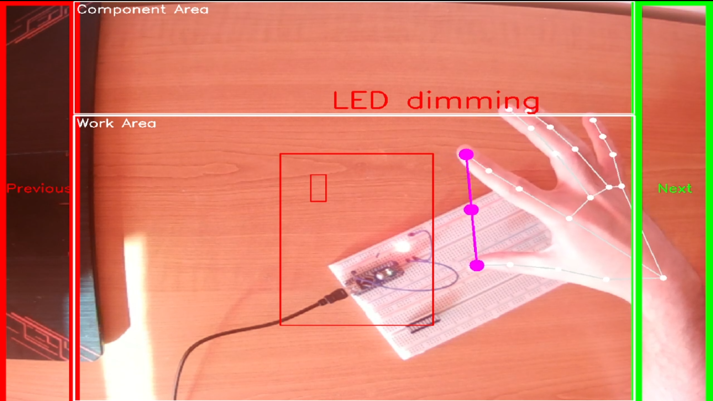

# Overview
HandFlow is a project that combines the power of machine learning and computer vision to assist users in assembling components onto a breadboard. 
By guiding the user's hand to specific points, it simplifies the process, making it more efficient and accessible, especially for beginners or those with limited experience in electronics.
# Features
* Hand Tracking: Utilizes Google's mediapipe library for hand tracking algorithms to accurately guide the user's hand
* Component Outline Display: Shows the outline of the component on the screen for precise placement
* User-friendly Interface: There is no need to use the mouse or keyboard, you can switch to the next or previous component with hand gestures
* The dimming of the LED is controlled by the distance between your index finger and thumb
* The user is able to train an AI model to recognize individual components!
# Requirements
Python 3.7


pip 23.1.2


opencv-python
```
pip install opencv-python
```

mediapipe
```
pip install mediapipe
```

tensorflow
```
pip install tensorflow
```
# Usage
Video Demo: https://drive.google.com/file/d/1T-g8H8FMRgtZkFxLr6F5TRmC7R2uDru1/view?usp=sharing

Run handTrackingModule.py





